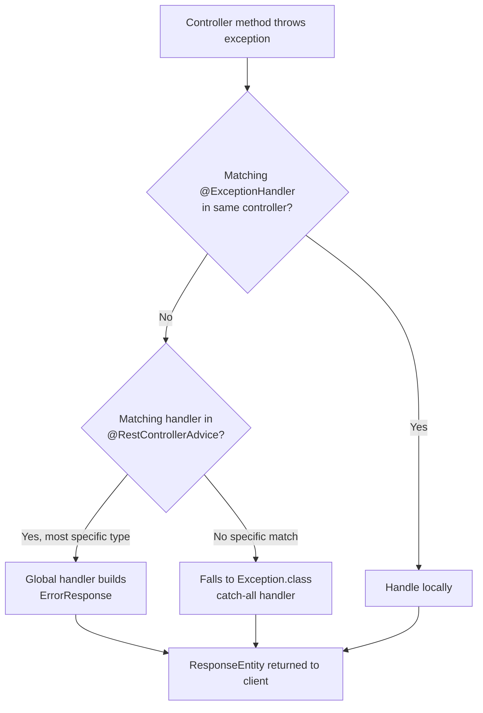

# Exception Handling in Spring Boot

> Topic file for Spring Boot learning repo | Pattern: Concept → Code → Diagram → Interview Notes → Pitfalls → Practice Questions

---

## 1. Concept Overview

Exception handling in Spring Boot centralizes error handling so controllers stay clean and every API error returns a **consistent, predictable JSON shape** instead of a raw stack trace or Whitelabel Error Page.

**Core goals:**
- Decouple error-handling logic from business logic
- Return consistent HTTP status codes + error bodies
- Avoid leaking internal details (stack traces, SQL errors) to clients
- Make errors debuggable via logs while keeping client responses clean

**Where it fits in request flow:**
```
Client → DispatcherServlet → HandlerMapping → Controller → Service → Repository
                                                    ↓ (exception thrown)
                                          HandlerExceptionResolver chain
                                                    ↓
                                    @ExceptionHandler in @ControllerAdvice
                                                    ↓
                                          ResponseEntity<ErrorResponse> → Client
```

---

## 2. Annotations & Components — Full Reference

| Annotation / Class | Scope | Purpose |
|---|---|---|
| `@ExceptionHandler` | Single controller (or global if in `@ControllerAdvice`) | Handles a specific exception type |
| `@ControllerAdvice` | Application-wide | Marks a class as a global exception handler |
| `@RestControllerAdvice` | Application-wide | `@ControllerAdvice` + `@ResponseBody` → returns JSON directly |
| `@ResponseStatus` | On exception class or handler method | Sets HTTP status without manual `ResponseEntity` |
| `ResponseEntityExceptionHandler` | Base class | Spring's built-in class with pre-overridden handlers for common Spring MVC exceptions |
| `HandlerExceptionResolver` | Interface | Lower-level mechanism Spring uses internally to resolve exceptions into responses |
| `ProblemDetail` (Spring 6+/Boot 3+) | Response body | Standardized RFC 7807 error response format, built into Spring now |

---

## 3. Code Demo — Full Working Setup

### 3.1 Custom Exception Hierarchy

```java
// Base exception - abstract, carries HTTP status + error code
public abstract class BaseException extends RuntimeException {
    private final HttpStatus status;
    private final String errorCode;

    protected BaseException(String message, HttpStatus status, String errorCode) {
        super(message);
        this.status = status;
        this.errorCode = errorCode;
    }

    public HttpStatus getStatus() { return status; }
    public String getErrorCode() { return errorCode; }
}
```

```java
public class ResourceNotFoundException extends BaseException {
    public ResourceNotFoundException(String message) {
        super(message, HttpStatus.NOT_FOUND, "RESOURCE_NOT_FOUND");
    }
}

public class DuplicateResourceException extends BaseException {
    public DuplicateResourceException(String message) {
        super(message, HttpStatus.CONFLICT, "DUPLICATE_RESOURCE");
    }
}

public class UnauthorizedException extends BaseException {
    public UnauthorizedException(String message) {
        super(message, HttpStatus.UNAUTHORIZED, "UNAUTHORIZED");
    }
}
```

**Why abstract base class?** One `@ExceptionHandler(BaseException.class)` catches all subclasses — no need to write a handler per exception type. Still allows specific handlers to override behavior when needed (Spring picks the most specific match).

### 3.2 Standard Error Response DTO

```java
public class ErrorResponse {
    private String errorCode;
    private String message;
    private int status;
    private LocalDateTime timestamp;
    private String path;               // which endpoint failed
    private Map<String, String> fieldErrors; // for validation errors

    public ErrorResponse(String errorCode, String message, int status, String path) {
        this.errorCode = errorCode;
        this.message = message;
        this.status = status;
        this.path = path;
        this.timestamp = LocalDateTime.now();
    }
    // getters/setters
}
```

### 3.3 Global Exception Handler

```java
@RestControllerAdvice
@Slf4j
public class GlobalExceptionHandler {

    // 1. Custom domain exceptions (catches ALL BaseException subclasses)
    @ExceptionHandler(BaseException.class)
    public ResponseEntity<ErrorResponse> handleBaseException(
            BaseException ex, HttpServletRequest request) {
        log.error("Business exception: {}", ex.getMessage());
        ErrorResponse error = new ErrorResponse(
                ex.getErrorCode(), ex.getMessage(),
                ex.getStatus().value(), request.getRequestURI());
        return ResponseEntity.status(ex.getStatus()).body(error);
    }

    // 2. Bean Validation failures (@Valid on @RequestBody)
    @ExceptionHandler(MethodArgumentNotValidException.class)
    public ResponseEntity<ErrorResponse> handleValidation(
            MethodArgumentNotValidException ex, HttpServletRequest request) {
        Map<String, String> fieldErrors = new HashMap<>();
        ex.getBindingResult().getFieldErrors()
          .forEach(fe -> fieldErrors.put(fe.getField(), fe.getDefaultMessage()));

        ErrorResponse error = new ErrorResponse(
                "VALIDATION_FAILED", "Input validation failed",
                HttpStatus.BAD_REQUEST.value(), request.getRequestURI());
        error.setFieldErrors(fieldErrors);
        return ResponseEntity.badRequest().body(error);
    }

    // 3. Path variable / request param validation (@Validated on controller)
    @ExceptionHandler(ConstraintViolationException.class)
    public ResponseEntity<ErrorResponse> handleConstraintViolation(
            ConstraintViolationException ex, HttpServletRequest request) {
        ErrorResponse error = new ErrorResponse(
                "CONSTRAINT_VIOLATION", ex.getMessage(),
                HttpStatus.BAD_REQUEST.value(), request.getRequestURI());
        return ResponseEntity.badRequest().body(error);
    }

    // 4. Malformed JSON body
    @ExceptionHandler(HttpMessageNotReadableException.class)
    public ResponseEntity<ErrorResponse> handleMalformedJson(
            HttpMessageNotReadableException ex, HttpServletRequest request) {
        ErrorResponse error = new ErrorResponse(
                "MALFORMED_JSON", "Request body is not readable",
                HttpStatus.BAD_REQUEST.value(), request.getRequestURI());
        return ResponseEntity.badRequest().body(error);
    }

    // 5. Method not supported (e.g., GET on a POST-only endpoint)
    @ExceptionHandler(HttpRequestMethodNotSupportedException.class)
    public ResponseEntity<ErrorResponse> handleMethodNotAllowed(
            HttpRequestMethodNotSupportedException ex, HttpServletRequest request) {
        ErrorResponse error = new ErrorResponse(
                "METHOD_NOT_ALLOWED", ex.getMessage(),
                HttpStatus.METHOD_NOT_ALLOWED.value(), request.getRequestURI());
        return ResponseEntity.status(HttpStatus.METHOD_NOT_ALLOWED).body(error);
    }

    // 6. Database constraint violations (e.g., unique key clash)
    @ExceptionHandler(DataIntegrityViolationException.class)
    public ResponseEntity<ErrorResponse> handleDataIntegrity(
            DataIntegrityViolationException ex, HttpServletRequest request) {
        ErrorResponse error = new ErrorResponse(
                "DATA_INTEGRITY_VIOLATION", "Database constraint violated",
                HttpStatus.CONFLICT.value(), request.getRequestURI());
        return ResponseEntity.status(HttpStatus.CONFLICT).body(error);
    }

    // 7. Catch-all — MUST be last / least specific
    @ExceptionHandler(Exception.class)
    public ResponseEntity<ErrorResponse> handleGeneric(
            Exception ex, HttpServletRequest request) {
        log.error("Unhandled exception", ex); // full stack trace goes to logs only
        ErrorResponse error = new ErrorResponse(
                "INTERNAL_ERROR", "An unexpected error occurred",
                HttpStatus.INTERNAL_SERVER_ERROR.value(), request.getRequestURI());
        return ResponseEntity.internalServerError().body(error);
    }
}
```

### 3.4 Using `@ResponseStatus` (lighter-weight alternative)

```java
@ResponseStatus(HttpStatus.NOT_FOUND)
public class ProductNotFoundException extends RuntimeException {
    public ProductNotFoundException(String message) {
        super(message);
    }
}
```
No handler method needed — Spring returns 404 automatically when this is thrown. Good for simple cases; loses the structured `ErrorResponse` body unless combined with a handler.

### 3.5 Spring Boot 3 native `ProblemDetail` (RFC 7807)

```java
@ExceptionHandler(ResourceNotFoundException.class)
public ProblemDetail handleNotFound(ResourceNotFoundException ex) {
    ProblemDetail problem = ProblemDetail.forStatusAndDetail(
            HttpStatus.NOT_FOUND, ex.getMessage());
    problem.setTitle("Resource Not Found");
    problem.setProperty("errorCode", "RESOURCE_NOT_FOUND");
    problem.setProperty("timestamp", LocalDateTime.now());
    return problem;
}
```
This is the modern, standards-based way (Spring Boot 3.x / Spring 6+) — worth mentioning in interviews to show you're current.

---

## 4. Diagram — Resolution Flow



---

## 5. Interview Notes

**Q: Difference between `@ControllerAdvice` and `@RestControllerAdvice`?**
`@RestControllerAdvice` = `@ControllerAdvice` + `@ResponseBody` on every handler method — response is serialized directly to JSON/XML instead of resolving a view. Use `@RestControllerAdvice` for REST APIs, `@ControllerAdvice` if you're also handling MVC views.

**Q: How does Spring pick which `@ExceptionHandler` to invoke when multiple could match?**
Spring uses the **most specific exception type** in the hierarchy. If you throw `UserNotFoundException extends ResourceNotFoundException extends BaseException`, and handlers exist for both `ResourceNotFoundException` and `BaseException`, the `ResourceNotFoundException` handler wins.

**Q: Checked vs unchecked exceptions in Spring — which do you use for custom exceptions and why?**
Unchecked (`RuntimeException`). Reasons: (1) don't pollute method signatures with `throws` everywhere, (2) Spring's declarative transaction management **only rolls back on unchecked exceptions by default** (checked exceptions need explicit `@Transactional(rollbackFor = ...)`), (3) cleaner with functional-style/stream code.

**Q: What's `HandlerExceptionResolver`?**
The lower-level interface Spring MVC uses internally to resolve exceptions to responses. `@ExceptionHandler`/`@ControllerAdvice` is a higher-level abstraction built on top of a specific implementation (`ExceptionHandlerExceptionResolver`). You rarely implement this directly, but it's good to know it exists — Spring Boot auto-configures a chain of these resolvers.

**Q: How do you handle validation errors from `@Valid` in a global handler?**
Catch `MethodArgumentNotValidException` (for `@RequestBody`) and `ConstraintViolationException` (for `@RequestParam`/`@PathVariable` validated via `@Validated` at class level). Extract field errors from `BindingResult` and return a map of field → message.

**Q: Why should the generic `Exception.class` handler always come last / be least specific?**
Not about ordering in the file — Spring resolves by specificity regardless of declaration order. But conceptually: it's your safety net. Without it, unexpected exceptions (NPEs, third-party library errors) return Spring Boot's default Whitelabel Error Page or raw stack trace, leaking internals and giving inconsistent responses.

**Q: How would you avoid leaking sensitive info (stack traces, SQL, internal class names) to the client?**
Log the full exception (`log.error("...", ex)`) server-side, but return a generic sanitized message in the response body for 500-level errors. Only expose detailed messages for expected business exceptions (4xx) where the message is meant for the client (e.g., "Email already registered").

**Q: What happens if an exception is thrown inside an `@ExceptionHandler` method itself?**
It propagates up and Spring Boot's default error handling (`BasicErrorController` → Whitelabel page or generic JSON) takes over, since there's no handler for a handler. Keep handler methods simple and defensive.

**Q: How do you handle exceptions from an async call (`@Async`) or a scheduled task?**
`@ControllerAdvice` only works for exceptions in the request-handling thread. For `@Async` methods, implement `AsyncUncaughtExceptionHandler` and register it via `AsyncConfigurer`. For `@Scheduled`, wrap logic in try-catch manually since there's no request context to return a response to.

**Q: How would you handle a downstream service (e.g., microservice) being unreachable?**
Wrap the call (RestTemplate/WebClient) in try-catch for `ResourceAccessException` / `WebClientException`, throw a custom `ServiceUnavailableException` (mapped to 503), and optionally add resilience via Resilience4j (circuit breaker + fallback) rather than just try-catch.

**Q: What is `ProblemDetail` and why does it matter?**
Spring 6 / Boot 3's built-in implementation of RFC 7807 (Problem Details for HTTP APIs) — a standardized error response format (`type`, `title`, `status`, `detail`, `instance` + custom properties). Reduces need for a fully custom `ErrorResponse` DTO and signals familiarity with current Spring versions in interviews.

---

## 6. Common Pitfalls

1. **Forgetting `@RestControllerAdvice` needs to be a Spring-scanned bean** — if it's outside the component scan base package, it silently won't apply.
2. **Catching `Exception.class` too early / too broadly in a controller**, which prevents the global handler's more specific handlers from ever running for that controller.
3. **Returning the raw exception message to the client for internal errors** — can leak DB schema names, internal class paths, etc. Sanitize 500-level messages.
4. **Not setting `rollbackFor` for checked exceptions inside `@Transactional`** — by default Spring only rolls back on unchecked exceptions; a checked exception can silently commit a partial transaction.
5. **Throwing exceptions from inside a `@Async` method and expecting `@ControllerAdvice` to catch them** — it won't; async exceptions need `AsyncUncaughtExceptionHandler`.
6. **Overusing `@ResponseStatus` on exception classes for cases needing dynamic status/messages** — it's static per class; use `@ExceptionHandler` when the response needs to vary.
7. **Validation handler not covering `ConstraintViolationException`** — devs often handle `MethodArgumentNotValidException` (body validation) but forget `@PathVariable`/`@RequestParam` validation throws a different exception type.
8. **Not logging the exception before returning a sanitized response** — makes production debugging nearly impossible since you lose the stack trace.

---

## 7. Practice Questions

1. Write a `@RestControllerAdvice` that returns a 422 (`UNPROCESSABLE_ENTITY`) for a custom `BusinessRuleViolationException`, including the field that caused it in the response body.
2. Given `AccountNotFoundException extends ResourceNotFoundException extends BaseException`, if handlers exist for `ResourceNotFoundException` and `Exception`, which one handles a thrown `AccountNotFoundException`? Why?
3. Modify the `GlobalExceptionHandler` above to also handle `MissingServletRequestParameterException` (thrown when a required `@RequestParam` is missing) with a 400 response.
4. Design the exception flow for your phishing-detection Spring Boot → Python (LightGBM/SHAP) microservice call: what exceptions would you catch for (a) timeout, (b) connection refused, (c) malformed response from the Python service, and what HTTP status would each map to?
5. Explain, without code, why `@ExceptionHandler` methods inside `@ControllerAdvice` are matched by exception specificity and not by declaration order — trace through what would happen if you swapped the order of two handlers in the class.
6. Write a JUnit + MockMvc test that asserts a `GET /users/999` (non-existent id) returns status 404 with JSON body `errorCode: "RESOURCE_NOT_FOUND"`.

---

## 8. Quick Reference Table

| Exception thrown | Typical cause | Suggested HTTP status |
|---|---|---|
| `MethodArgumentNotValidException` | `@Valid` fails on `@RequestBody` | 400 |
| `ConstraintViolationException` | `@Validated` fails on param/path var | 400 |
| `HttpMessageNotReadableException` | Malformed JSON body | 400 |
| `MissingServletRequestParameterException` | Required `@RequestParam` missing | 400 |
| `HttpRequestMethodNotSupportedException` | Wrong HTTP verb used | 405 |
| `AccessDeniedException` (Spring Security) | Authenticated but not authorized | 403 |
| `AuthenticationException` (Spring Security) | Not authenticated | 401 |
| Custom `ResourceNotFoundException` | Entity not found | 404 |
| `DataIntegrityViolationException` | DB constraint (unique/FK) violated | 409 |
| Custom `DuplicateResourceException` | Business-level duplicate | 409 |
| Generic `Exception` | Unexpected/unhandled | 500 |
| Downstream service unreachable | Timeout / connection refused | 503 |
